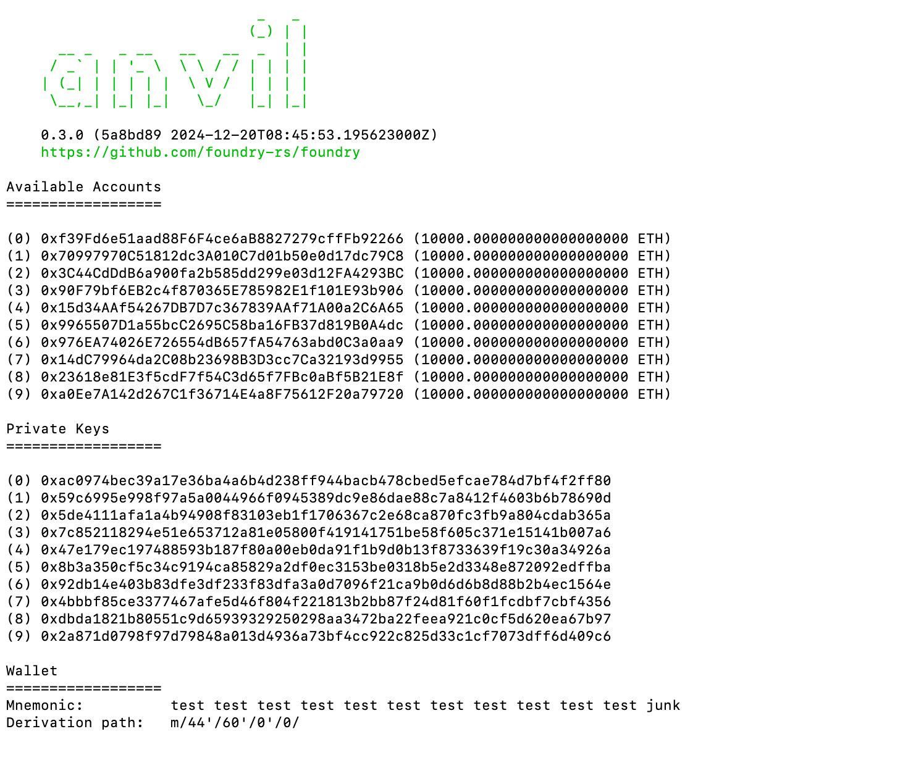
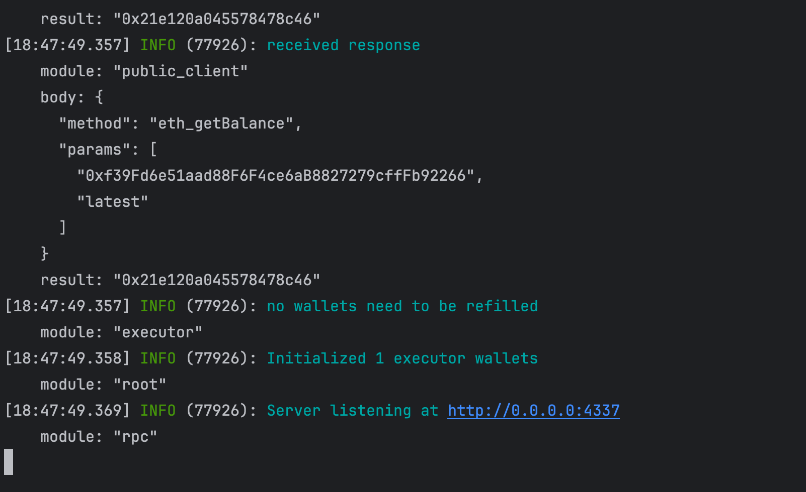

# poc-eip7702

use 7702 send tx 

1. run a ethereum node in pergue vuersion 
```shell
curl -L https://foundry.paradigm.xyz | bash
anvil --hardfork prague
```

you will see

2. run a bundler with entrypoint v6
```shell
git clone https://github.com/pimlicolabs/alto
cd alto
pnpm install
```

init contract (entrypoint ,safe wallet contract)
```shell
ts-node scripts/localDeployer/index.ts
```
start bundler
```shell
./alto --config scripts/config.local.json
```shell


you will see


A POC for using unSafe contracts with EIP-7702

```bash
git clone https://github.com/safe-global/safe-smart-account.git

```
https://pectra-devnet-5.ethpandaops.io/


----
combine 7702 with 4337

